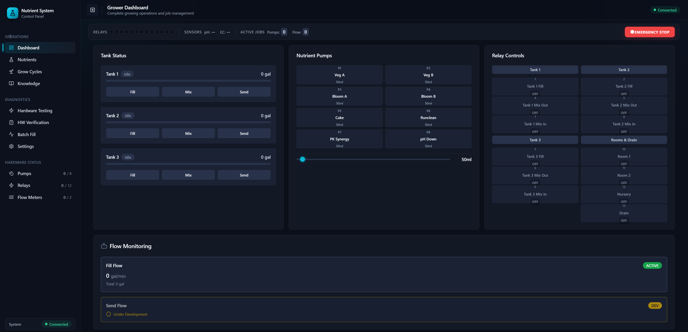

# Nutrient Mixing System

A full-stack web application for controlling and monitoring an automated **hydroponic nutrient-mixing rig**. It drives real physical hardware — peristaltic dosing pumps, relay-actuated valves, flow meters, and EC/pH sensors — from a modern browser dashboard running on a Raspberry Pi.

The system automates the day-to-day work of a commercial grow operation: filling tanks with water, dosing precise volumes of liquid nutrients, mixing, monitoring water quality, and distributing the finished solution to grow rooms.

<p align="left">
  
  
  
  
  
  
  
</p>

> **Runs without hardware.** The app includes a full mock-hardware layer, so you can clone it and run the entire stack on any laptop — no Raspberry Pi or pumps required. See [Running in mock mode](#running-in-mock-mode).

> 🚧 **Actively developed.** This is a living project driving a real, in-use grow operation — features are added and refined as the rig evolves. See the [Roadmap](#roadmap) for what's currently in progress.

---

## Screenshots

### Grower Dashboard

The main operations view — tank status with fill/mix/send controls, the 8-channel nutrient pump bank, the full relay grid (tanks, mix valves, grow rooms), and live flow monitoring.



> _More views coming soon: the Batch Fill workflow and the Hardware Testing grid._

---

## Tech Stack

| Layer | Technology |
| --- | --- |
| **Frontend** | Svelte 5 (runes), Vite, Tailwind CSS 3, [bits-ui](https://bits-ui.com/) (shadcn-style component primitives), Lucide icons |
| **Backend** | Python 3, Flask, Flask-CORS, Server-Sent Events (SSE) for live status streaming |
| **Hardware I/O** | `lgpio` (GPIO — relays & flow-meter pulse counting), `smbus2` (I2C — Atlas Scientific EZO dosing pumps **and** EZO EC/pH sensors), `paho-mqtt` (ESP32 soil-moisture sensors), `pyserial` (UART — per-tank Arduino monitors) |
| **Platform** | Raspberry Pi 4B (production) · any OS in mock mode |

## Architecture

A two-tier design cleanly separates the browser UI from the hardware layer, with a single Flask process bridging the two.

```
┌────────────────────────────┐        REST + SSE        ┌────────────────────────────┐
│      Svelte 5 Frontend     │  ───────────────────────▶ │        Flask API (app.py)   │
│  (Vite dev server / static)│  ◀─────────────────────── │                             │
│  Dashboard · Fill Tank ·   │      JSON / event stream  │   Hardware abstraction      │
│  Nutrients · Grow Cycles   │                           │   layer (hardware_comms.py) │
└────────────────────────────┘                           └──────────────┬─────────────┘
                                                                         │
        ┌───────────────┬───────────────┬──────────────────┬────────────┴─────┬──────────────────┐
        │               │               │                  │                  │                  │
   I2C (smbus2)    I2C (smbus2)    GPIO (lgpio)       GPIO (lgpio)      MQTT (paho-mqtt)    UART (pyserial)
        │               │               │                  │                  │                  │
 ┌──────▼──────┐ ┌──────▼──────┐ ┌───────▼──────┐  ┌────────▼───────┐ ┌────────▼───────┐ ┌────────▼───────┐
 │ 8× EZO      │ │ EZO EC/pH   │ │ 12× relays   │  │ 2× flow meters │ │ ESP32 soil-    │ │ per-tank EC/pH │
 │ dosing pumps│ │ sensors     │ │ (valves/mix) │  │ (pulse counter)│ │ moisture nodes │ │ Arduino nodes  │
 └─────────────┘ └─────────────┘ └──────────────┘  └────────────────┘ └────────────────┘ └────────────────┘
```

All hardware commands flow through a single abstraction layer (`hardware/hardware_comms.py`) that speaks a simple, consistent wire protocol (`Start;<Type>;<Id>;<Param>;end`). Every controller has a mock counterpart, so the exact same API surface works with or without physical devices.

## Features

- **Grower Dashboard** — high-level operations view for running and tracking mixing jobs.
- **Fill Tank operations** — guided fill → dose → mix → send workflow with a live flowchart, config panel, and on-screen system log.
- **Nutrient management** — manual dosing plus recipe/formula management for 8 named nutrient channels (Veg A/B, Bloom A/B, Cake, PK Synergy, Runclean, pH Down).
- **Grow-cycle tracking** — plant-cycle records and daily watering reports.
- **Hardware testing (Stage 1)** — direct component-level control of every relay, pump, flow meter, and the EC/pH sensor for bring-up and diagnostics.
- **Live monitoring** — EC/pH readings and hardware status pushed to the browser over Server-Sent Events.
- **Soil-moisture sensing** — wireless ESP32 sensor nodes report over MQTT; readings are ingested by the backend and surfaced alongside the mixing operations (firmware in `hardware/firmware/`).
- **Pump calibration** — per-pump volume calibration with persisted calibration state.
- **Knowledge base** — built-in growing reference material and SOPs (crop steering, nutrients, environment, lighting, IPM, operations).
- **Safety systems** — single-instance lockfile guarding, input validation on all hardware commands, all-relays-off / emergency-stop paths.
- **Settings** — user and developer configuration surfaced from a single centralized `config.py`.

## Project Structure

```
batch-dashboard/
├── app.py                    # Flask REST API server (50+ endpoints)
├── main.py                   # FeedControlSystem — core control loop & command processing
├── config.py                 # Centralized hardware mappings, tanks, pumps, limits
├── hardware_safety.py        # Single-instance lockfile / safety setup
├── requirements.txt
│
├── dosing_job.py             # Closed-loop batch dosing job engine
├── grow_cycles.py            # Grow-cycle records & watering reports
│
├── hardware/                 # Hardware abstraction layer
│   ├── hardware_comms.py     # Public interface used by the API
│   ├── rpi_pumps.py          # EZO dosing pumps over I2C
│   ├── rpi_relays.py         # Relay bank over GPIO
│   ├── rpi_flow.py           # Flow-meter pulse counting
│   ├── rpi_ezo_sensors.py    # EZO EC/pH sensors over I2C (native Pi)
│   ├── soil_sensors.py       # ESP32 soil-moisture ingest over MQTT
│   ├── tank_monitor.py       # Per-tank EC/pH Arduino monitors
│   ├── mock_controllers.py   # Mock hardware for dev without a Pi
│   ├── utilities/            # Relay mapping & bring-up helpers
│   └── firmware/             # ESP32 soil-sensor firmware (Arduino sketch)
│
├── frontend/                 # Svelte 5 single-page app
│   ├── src/
│   │   ├── App.svelte        # Shell + page navigation
│   │   ├── *.svelte          # Pages (Dashboard, FillTank, Nutrients, GrowCycles, …)
│   │   ├── components/       # Feature components
│   │   └── lib/              # UI primitives, stores, knowledge-base data
│   ├── vite.config.js
│   └── tailwind.config.js
│
├── tools/                    # Standalone diagnostics & hardware test scripts
├── scripts/                  # Deployment: systemd service, startup, mosquitto setup
└── docs/
    └── HARDWARE_COMMANDS.md   # Full hardware command reference
```

## Getting Started

### Prerequisites

- **Python 3.11+**
- **Node.js 18+** and npm
- (Optional) A Raspberry Pi 4B with the wired hardware for real operation

### 1. Backend (Flask API)

```bash
# From the repo root
python -m venv .venv
source .venv/bin/activate        # Windows: .venv\Scripts\activate

pip install -r requirements.txt

cp .env.example .env             # adjust ports / allowed origins if needed
python app.py                    # serves the API on http://localhost:5000
```

> On non-Raspberry-Pi machines, `lgpio` and `smbus2` may not install or import — that's expected. The app detects this and falls back to **mock mode** automatically.

### 2. Frontend (Svelte + Vite)

```bash
cd frontend
npm install
cp .env.example .env.development.local   # point VITE_API_URL at your backend
npm run dev                              # dev server on http://localhost:5173
```

Open **http://localhost:5173** — the Vite dev server proxies API calls to Flask.

### 3. Production build

```bash
cd frontend
npm run build        # outputs static assets to frontend/static/dist/
```

Flask then serves the built app directly, so a production deployment on the Pi runs a single process (`python app.py`) hosting both the API and the UI.

## Running in Mock Mode

No hardware? No problem. The mock controllers in `hardware/mock_controllers.py` simulate pumps, relays, flow meters, and EC/pH readings, so the full UI is interactive end-to-end. This is the default behavior on any machine where the Raspberry Pi hardware libraries are unavailable, making the project easy to explore, demo, or develop against.

## API Overview

The REST API follows a consistent `"/api/{hardware_type}/{id}/{action}"` pattern. A few representative endpoints:

| Method | Endpoint | Purpose |
| --- | --- | --- |
| `GET`  | `/api/system/status` | Full system status snapshot |
| `GET`  | `/api/system/status/stream` | Live status stream (SSE) |
| `POST` | `/api/pumps/<id>/dispense` | Dose a precise volume from a pump |
| `POST` | `/api/pumps/<id>/calibrate` | Calibrate a pump |
| `POST` | `/api/relays/<id>/control` | Open/close a relay-actuated valve |
| `POST` | `/api/flow/<id>/start` | Start a metered fill |
| `POST` | `/api/ecph/start` | Begin EC/pH monitoring |
| `POST` | `/api/relay/all/off` | All relays off (safety) |

See [`docs/HARDWARE_COMMANDS.md`](docs/HARDWARE_COMMANDS.md) for the complete command and protocol reference.

## Roadmap

This project is under active development and grows alongside the physical rig it runs. Currently in progress:

- **Automatic send flow** — closed-loop metered distribution of finished solution to grow rooms (the *Send Flow* panel is wired up and marked _under development_ in the UI today).
- **Deeper soil-sensor integration** — surfacing the wireless ESP32 soil-moisture readings directly in the operations dashboard and using them to inform watering decisions.
- Ongoing refinements to calibration, batch-dosing accuracy, and the tablet UI.

Have an idea or spot a bug? Issues and suggestions are welcome.

## Safety Notice

This software controls physical equipment that moves liquids and switches mains-adjacent relays. It is provided as a portfolio/reference project. If you adapt it to drive real hardware, do so at your own risk and add appropriate physical safeguards (fusing, containment, e-stop, sensor limits). See the disclaimer in the [license](LICENSE).

## License

Released under the [MIT License](LICENSE).
